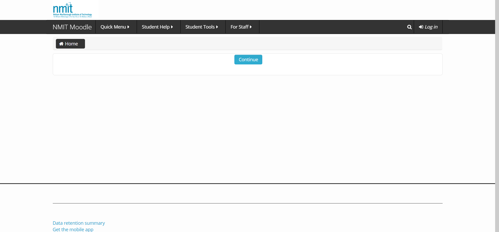
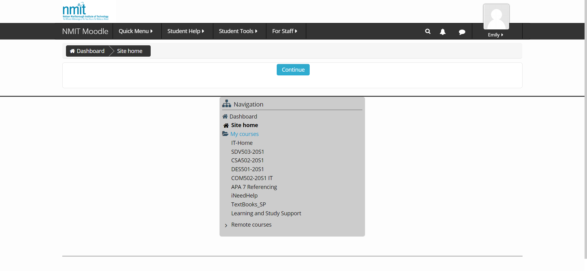

# GitBook Activity 4.2


1.      User experience widely encompasses all user interaction using an organisation’s products or services. In this sense, usability forms an aspect of user experience, mainly related to the functionality of a product or service. Therefore, the difference between the two is that user experience is representative of the users’ feelings regarding all aspects of use, whereas usability relates more to consistency, effectiveness, and ease of use.

2.      The most important factors in assessing the usability of a system are: How easy is the system to use for your intended user \(Does it require any unusual pre-requisite knowledge? Are instructions easy to follow?\), and how well does the system perform the functions the user expects it to \(Are there delays or errors? Is it consistent?\).

3.      

A. An example of a website with good usability is Twitch, a community streaming website. The site has a clean layout with very little wasted space, but manages not to appear too clustered. Navigating the website is intuitive and beginner friendly, as buttons are highly visible and pertinent information is made available in an accessible way. The website has very little delay for a mass streaming service, and throws errors very infrequently. The website also features an optional dark theme.

B. An example of a website with poor usability is NMIT Moodle, an education hub for a tertiary education organisation. The website throws an error every time I log in, forcing me to press the log in button a second time, the calendar also frequently fails to display pop-up boxes. The website is difficult to navigate, with the layout appearing fairly sparse. Additionally, important pages can be hard to reach and many links end up leading to dead ends or redirecting to other pages requiring a second log in.

