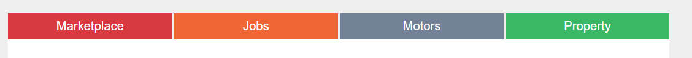
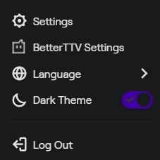
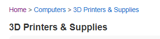
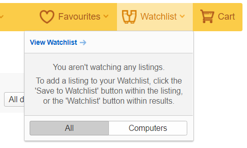
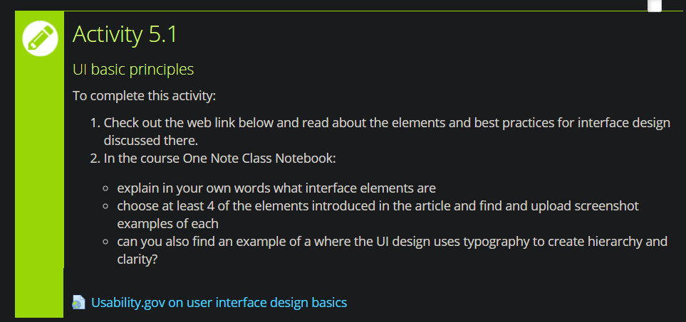

# GitBook Activity 5.1

**GitBook Activity 5.1**

Interface elements refer to the visual software aspects of an interface with which the user can navigate, scroll, search, or otherwise interact with your design. Four examples of interface elements are:

-        Buttons

\*From trademe.co.nz

-        Toggles

\*From twitch.tv

-        Breadcrumbs

\*From trademe.co.nz

-        Tool Tips

\*From trademe.co.nz

An example of using typography to create hierarchy and clarity can be found in the description for this activity:

